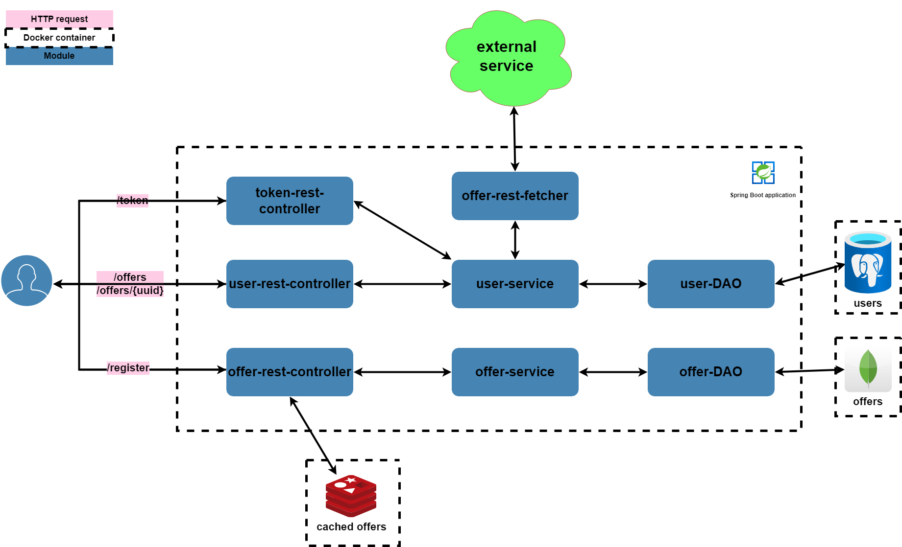

<h1 align="center">Job Offers - Backend
</h1>

This project is a web application created in Spring Boot
which allows users to search for and add new job offers. 
To build the architecture of the project, I used the Ports-and-Adapters pattern.
This project's goal is to group offers from all sites in one place. 
You can check this project out by yourself 
on [Swagger UI](https://michal-luczak.pl/job-offers/api/swagger-ui/index.html).
If you want to see frontend also, you can 
go to [JobOffers-ReactApp](https://github.com/michal-luczak/JobOffers-ReactApp).
To see full version of app deployed on AWS click [here](https://michal-luczak.pl/job-offers).
## Diagram


## Tech Stack
Code: <br>


<br>
Tests: <br>


 
<br>
CI/CD: <br>

<br>
Other: <br>


## Solved Problems
During the development of this project I had to face of a bunch of problems. These are a few of them.
<ul>
    <li>Organize code with independent modules</li>
    <li>Manage dependencies for these modules</li>
    <li>Build code that is maximal encapsulated</li>
    <li>Stick to predetermined architecture (Ports-and-Adapters)</li>
    <li>Authorization with JWT token and Spring Security</li>
    <li>Integration tests with TestContainers</li>
    <li>Stick to the SOLID rules</li>
    <li>AWS deploying with EC2 and ECR</li>
    <li>Continuous integration and Continuous Deployment with CircleCi (to ECR AWS)</li>
    <li>Organize work with GitHub flow</li>
</ul>

## How to build the project on your own
#### To build the project:
<ol>
<li>Clone the repository:</li>

```
git clone https://github.com/michal-luczak/JobOffers-SpringBootApplication.git
```
<li>Go to the folder with cloned repository</li> 
<li>Run the command:</li>

```
mvn package -DskipTests
```
<li>In folder target you should find a file named: application-{version}-SNAPSHOT.jar</li>
</ol>

#### To build the docker image with Docker Compose:
<ol>
<li>Clone the repository:</li>

```
git clone https://github.com/michal-luczak/JobOffers-SpringBootApplication.git
```
<li>Go to the folder with cloned repository</li> 
<li>Run the command:</li>

```
docker-compose build
```
<li>By using:

```
docker images
```
You should see the image named as you set at `services.job-offers.image` on file `docker-compose.yml`. 
By default, it is the `509192113520.dkr.ecr.eu-central-1.amazonaws.com/job-offers:latest`.
</li>
</ol>

## What I'm going to do in future
There are many things that I'm going to do in this project in the future. Few of them:
<ul>
    <li>Hide the secrets (usernames and passwords for example to databases)</li>
    <li>Add more parameters to Offers like: Company icon, more details about the offers etc.</li>
    <li>Implement microservices architecture by using AWS, docker containerization and kafka for example</li>
    <li>Add roles ADMIN, USER etc. Admins would be able to remove offers</li>
    <li>Add email verification</li>
    <li>Use the ElasticSearch to create opportunity to find some offers by title for example</li>
</ul>
